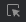
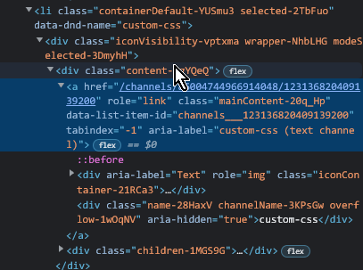
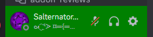

[bd]: img/bd.png
[rp]: img/rp.png
[vc]: img/vc.png

# Learn To Theme

**<span title="Too long; didn't read">TL;DR</span>: Use [bdeditor.dev](https://bdeditor.dev/), if you just want to set a colour scheme with a background image, and don't have the time or energy to read this page.**

**<span title="Too long; didn't read">TL;DR</span>: If you would like to theme and would like to jump right in, see [my theme template](https://github.com/Saltssaumure/template-discord-theme) which is the culmination of everything written here.**

*Now for actual content.*

This guide assumes that you know:
- how to use your computer,
- a little about HTML, and
- nothing about CSS or GitHub or npm.

I am writing this guide with the main three client mods in mind:
- [![icon][bd] BetterDiscord](https://betterdiscord.app/),
- [![icon][rp] Replugged](https://replugged.dev/),
- [![icon][vc] Vencord](https://vencord.dev).

However, the general principles apply to most desktop client mods.

## Step 1: Learning general CSS
Learning the basics of CSS by doing a few hours of not-theme projects or tutorials first. This is because working from a clean slate of nothing is easier than trying to understand what other people have written. Once you have a decent grasp of what CSS is and how you could use it, you can head over to Step 2.

[webdev-20]: https://www.youtube.com/watch?v=1PnVor36_40
[moz-css]: https://developer.mozilla.org/en-US/docs/Learn/Getting_started_with_the_web/CSS_basics
[moz-web]: https://developer.mozilla.org/en-US/docs/Learn/Getting_started_with_the_web
[w3s-css]: https://www.w3schools.com/css/default.asp
[google-css]: https://web.dev/learn/css/s

### Tutorials

| Link                                                        | Description                                                           |
| ----------------------------------------------------------- | --------------------------------------------------------------------- |
| [Web Dev Simplified's *Learn CSS in 20 minutes*][webdev-20] | A video that gives you a speedy overview of CSS.                      |
| [Mozilla's *CSS Basics*][moz-css]                           | A document similar to the video above, being a quick overview of CSS. |
| [Mozilla's *Get started with the web*][moz-web]             | The context for the above CSS tutorial.                               |
| [w3schools' *CSS Tutorial*][w3s-css]                        | A longer practical-first guide. Includes exercises and quizzes.       |
| [Google's *Learn CSS*][google-css]                          | A longer theory-first guide. Includes exercises and quizzes.          |

### Useful reference material

#### Properties

| Link                                                                  | Description                                                                                        |
| --------------------------------------------------------------------- | -------------------------------------------------------------------------------------------------- |
| [w3schools](https://www.w3schools.com/cssref/index.php)               | Simple with some examples for basic usage.                                                         |
| [Mozilla](https://developer.mozilla.org/en-US/docs/Web/CSS/Reference) | Slightly more verbose, more precise explanations and comprehensive examples compared to w3schools. |

#### Other

| Link                                                                                                              | Description                                                                                                                                                                                              |
| ----------------------------------------------------------------------------------------------------------------- | -------------------------------------------------------------------------------------------------------------------------------------------------------------------------------------------------------- |
| [CSS-Tricks' *A Complete Guide to Flexbox*](https://css-tricks.com/snippets/css/a-guide-to-flexbox/)              | `flex` is incredibly useful for arranging content in a container without hardcoding sizes, but the property names are many and not particularly descriptive. This explains well what each property does. |
| [CSS-Tricks' *A Complete Guide to CSS Grid*](https://css-tricks.com/snippets/css/complete-guide-grid/)            | `grid` is the modern way to tile content, and this again helps with the terminology.                                                                                                                     |
| [w3schools' *CSS Selector Reference*](https://www.w3schools.com/cssref/css_selectors.php)                         | A list with examples of how to use every selector and selector combinator.                                                                                                                               |
| [Chrome Developers' *DevTools CSS features reference*](https://developer.chrome.com/docs/devtools/css/reference/) | A guide for using DevTools effectively in Chrome/Chromium.                                                                                                                                               |

## Step 2: Writing Custom CSS and Themes
If you know some CSS, this is the place to start.

### 2.1: Developer settings
Before beginning, DevTools is a requirement to find class names and view Discord's default styles for those classes. Open DevTools with `Ctrl + Shift + I` (windows/linux) / `Cmd + Opt + I` (mac).

#### ![icon][bd] BetterDiscord
1. Open `Settings` > `BetterDiscord` > `Settings` > `Developer Settings`.
2. Enable the following: 
   - DevTools (mandatory)
   - Debugger Hotkey (convenient for quickly checking hover-only styles)
   - Inspect Element Hotkey (convenient shortcut)
   - Stop DevTools Warning (makes Console tab in devtools actually readable)

#### ![icon][rp] Replugged and ![icon][vc] Vencord
No extra steps needed, DevTools is enabled by default.

### 2.2: Writing Custom / Quick CSS
1. With the  Inspect Element tool (top left corner of DevTools), click on an area that you want to style.
   - Clicking may not always give the exact right element, you may need to go up or down some levels in the document viewer panel.  
.
2. Copy the class name and write your styles for it in Custom / Quick CSS. Remember to save (and/or turn on Live Update) to see your changes.  

#### Example
```css
/* Turns the user panel green */
.container_ca50b9 {
    background: green;
}
```


#### Notes
- The in-app editor can be sluggish on less powerful devices, especially with `Live CSS` / `Automatically Apply Quick CSS` enabled. Try an external editor (eg. Notepad++, Nano, VSCode) if you experience issues.

### 2.3: Writing a theme
Custom / Quick CSS can quickly get cluttered and hard to navigate, so it's better to write a theme in a separate file:

#### ![icon][bd] BetterDiscord and ![icon][vc] Vencord
This is covered by the [BetterDiscord themes guide](https://docs.betterdiscord.app/themes/introduction/quick-start). Here's a summary:

1. Go to the `themes` folder: `Settings` > `Themes` > `Open Theme Folder`.
2. Make a file with name ending in `.theme.css`, eg. `MyTheme.theme.css`.
3. Start the contents with the theme meta:
```css
/**
 * @name My Theme
 * @author My Name
 * @description This is my theme. There are many like it, but this one is mine.
 * @version 1.0
 */
```
4. Add your CSS rules after the meta.

##### Notes
- See the BetterDiscord docs for the [full list of meta fields](https://docs.betterdiscord.app/developers/addons/#meta).
- The meta is allowed to contain other unrecognised fields, eg. `@license`, which will be simply ignored by the mod.

#### ![icon][rp] Replugged
1. Go to the `themes` folder: `Settings` > `Themes` > `Open Themes Folder`.
2. Make a folder with the name of your theme, eg. `MyTheme`.
3. In that folder, make:
    1. A file named `manifest.json` with the theme manifest:  
    ```json
    {
        "id": "com.example.mytheme",
        "name": "My Theme",
        "author": {
            "name": "My Name"
        },
        "description": "This is my theme. There are many like it, but this one is mine.",
        "version": "1.0.0",
        "license": "MIT",
        "type": "replugged-theme"
    }
    ```
    2. A file named `main.css` with your CSS rules.

##### Notes
- See the Replugged docs for the [full list of manifest keys](https://guide.replugged.dev/docs/manifest).
- Use [choosealicense.com](https://choosealicense.com/) to find a license that suits your needs. The MIT license is common for open source projects, but you can use any license you like.

## Step 3: Using Git and GitHub to track changes
Using Git to track changes, and uploading the theme to GitHub, provide several benefits:
1. Convenience for sharing the latest version of the theme with other people.
2. Backup in case the copy on your computer is lost.
3. Ability to roll back to old versions of the theme if you make a mistake.
4. The ability to submit a theme for official approval on ![icon][bd] BetterDiscord and ![icon][rp] Replugged.
5. ![icon][vc] Vencord users can use the online themes feature to quickly access your theme without needing to download it.

[gh-signup]: https://github.com/signup
[gh-newrepo]: https://GitHub.com/new
[ghdesk]: https://desktop.GitHub.com/
[ghdesk-clone]: https://docs.github.com/en/desktop/contributing-and-collaborating-using-github-desktop/adding-and-cloning-repositories/cloning-and-forking-repositories-from-github-desktop
[ghdesk-commit-select]: https://docs.github.com/en/desktop/contributing-and-collaborating-using-github-desktop/making-changes-in-a-branch/committing-and-reviewing-changes-to-your-project-in-github-desktop#selecting-changes-to-include-in-a-commit
[ghdesk-commit-message]: https://docs.github.com/en/desktop/contributing-and-collaborating-using-github-desktop/making-changes-in-a-branch/committing-and-reviewing-changes-to-your-project-in-github-desktop#write-a-commit-message-and-push-your-changes
[git-dl]: https://git-scm.com/downloads
[git-revert]: https://stackoverflow.com/questions/4114095/how-do-i-revert-a-git-repository-to-a-previous-commit
[git-guide]: https://docs.github.com/en/get-started/getting-started-with-git
[gitkraken]: https://www.gitkraken.com/

### 3.1: Setting up the theme repository on GitHub
1. [Make a GitHub account][gh-signup].
2. Make a [new repository][gh-newrepo].
    - Set visibility to Public, to allow setting up GitHub Pages.
    - README, .gitignore, and license can be added later if needed.
3. Click `Add File` and upload your theme file(s).
4. In the repository's Settings, go to `Pages` > `Build and deployment` > `Source`, selecting `Deploy from a branch`.
5. The option of selecting a branch and folder will now appear. For now, `main` and `/ (root)` are fine. Save the changes.

If you don't intend on making many/any changes to your theme, that's it done. Your theme can now be found at `https://accountname.github.io/RepoName/FileName`, eg. https://saltssaumure.github.io/xp-discord-theme/Exponent.theme.css.

### 3.2: Using Git to track your theme updates
1. [Download][git-dl] and install Git.
2. Install [GitHub Desktop][ghdesk].
3. [Clone your repository][ghdesk-clone] (ie, download it to your computer).
4. Inside the folder just created (which will be your repository's name by default), make any changes you like to the contents. You could edit the theme file, add other files, or delete unwanted files. Just don't change the `.git` folder or its contents.
5. Create a commit, a snapshot of the current state of the repository. In GitHub Desktop, [select the changed file(s)][ghdesk-commit-select] and [write a summary of the changes][ghdesk-commit-message] before clicking `Commit`.
    - Commit often, so that summaries are easy to write and mistakes can be [reverted][git-revert] without undoing a larger amount of work.
6. Push your commit(s) to GitHub to sync your changes, by clicking `Push to origin`.

There are other more powerful ways of using Git, eg. [command line][git-guide] and [GitKraken][gitkraken]. For basic purposes though, GitHub Desktop works just fine.

## Step 4: Auto-updating and splitting the theme

Writing and distributing a theme as a single file is fine for simple themes, but becomes more difficult to manage as the theme grows.
1. A long file is harder to navigate and edit.
2. Users need to redownload the theme manually when it is updated, which may be often during development and maintenance.

To solve both of these issues, we can split the CSS among many files, and use strategies to auto-update the themes for users.

### ![icon][bd] BetterDiscord
1. Create your subfile, eg. `innerworkings.css`.
2. Put your styles into `innerworkings.css`.
3. In `*.theme.css`, immediately following the meta, add the following line (replacing the URL as required):
   ```css
   @import url("https://accountname.github.io/MyTheme/innerworkings.css");
   ```
4. Commit and push the changes, and wait a few minutes (usually under 2 mins) for GitHub Pages to re-generate.

Now, toggling the theme in `Settings` > `Themes` will load `innerworkings.css` without needing to redownload the `*.theme.css` file. Repeat for as many subfiles as you like.

### ![icon][rp] Replugged

#### Splitting the theme
1. Create your subfile, eg. `innerworkings.css`.
2. Put your styles into `innerworkings.css`.
3. At the top of `main.css`, add an import for `innerworkings.css`:
```css
@import url("innerworkings.css");
```

#### Auto-updating
1. Install [npm](https://www.npmjs.com/get-npm) and [pnpm](https://pnpm.io/installation).
2. Move your theme folder to another location outside of the Replugged `themes` folder, as this will interfere with Replugged's addon updater.
3. Update your `manifest.json` to the following:
```json
{
    "id": "com.example.mytheme",
    "name": "My Theme",
    "author": {
        "name": "My Name",
        "github": "AccountName"
    },
    "description": "This is my theme. There are many like it, but this one is mine.",
    "version": "1.0.0",
    "license": "MIT",
    "type": "replugged-theme",
    "updater": {
        "type": "github",
        "id": "AccountName/MyTheme"
    },
    "source": "https://github.com/AccountName/MyTheme"
}
```
4. From the Replugged theme template, add the following to your theme folder:
   1. `.github/workflows/release.yml` - keep the folder structure intact too.
   2. `package.json` - feel free to edit the details, but it should work as-is.
   3. `.gitignore`
5. Run `pnpm install` in console.
6. When you have a new version of the theme ready to release, use `pnpm run publish` in console.

### ![icon][vc] Vencord
Vencord users can enjoy the benefit of auto-updating by using the Online Themes feature instead of Local Themes. However, it is still recommended to split the theme for the sake of maintainability, using the same steps as BetterDiscord above.

## Step 5: Theme development tools
I will probably continue writing more, but here's the highlights for now:
- [Sass/SCSS](https://sass-lang.com/), and tools for using it:
  - Gibbu's [create-bd-theme](https://github.com/Gibbu/create-bd-theme) tool.
  - My personalised version of Gibbu's tool, no CLI though: https://github.com/Saltssaumure/bd-scss
  - QuickSCSS, for writing custom/quick CSS in SCSS, and syncing across multiple client mods.
- [My theme template](https://github.com/Saltssaumure/template-discord-theme), which includes pretty much everything discussed here.
- [ClassUpdate](https://github.com/Saltssaumure/ClassUpdate) - a tool for automatically updating class names in themes.
